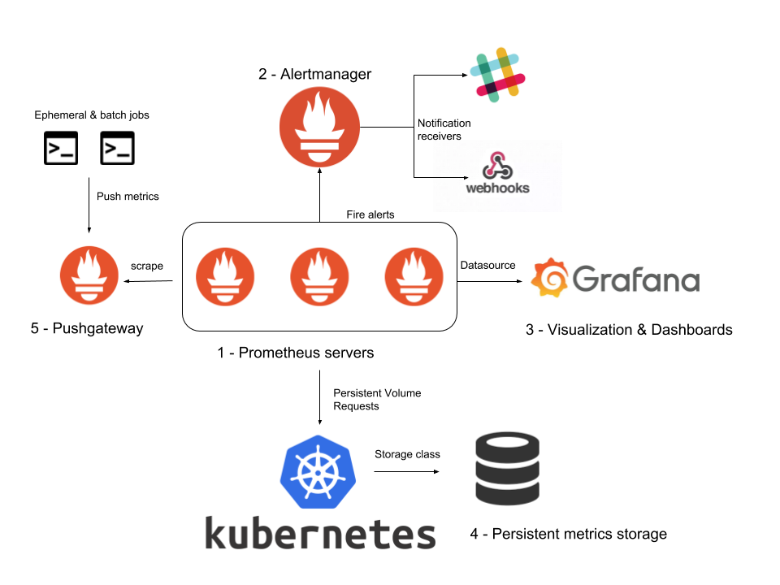
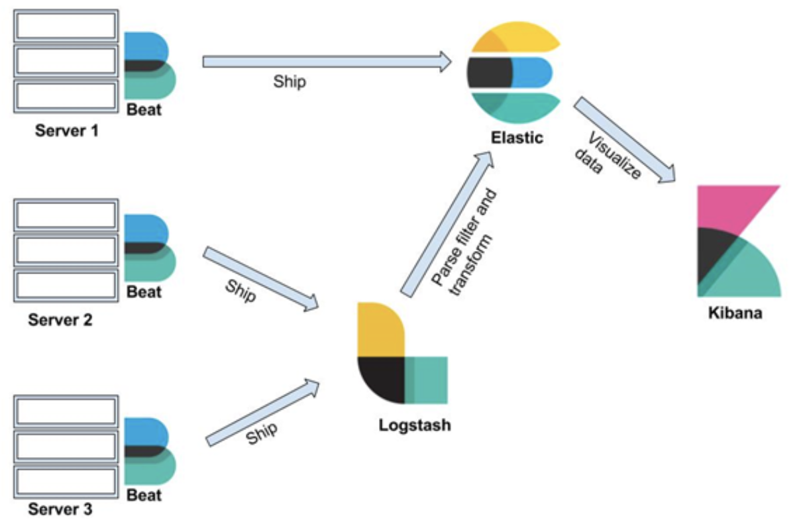

# gitops

---

## whoami

* Dominik Aschbacher
* 23 y/o
* DevOps Engineer @ BearingPoint

---

## agenda

* the problem
* a viable solution
* monitoring & observability

---

## the problem

changes are made without anyone knowing

---

## the old / manual way

everything is deployed manually

---

## the semi-automated way

* configuration in git
* custom deploy scripts
* ansible executed locally

---

## the solution

---

## ci/cd

* iac / cac
* rollout via ci/cd

---

## demo

---

## gitops

* controlled via agent in cluster
* reconciliation with source of truth (git)

---

## installing fluxcd

```bash
flux bootstrap github \
  --owner=aschbacd-labs \
  --repository=iac \
  --branch=main \
  --path=./flux/clusters/minikube \
  --token-auth
```

---

## demo

---

## monitoring & observability

---

## monitoring & alerting

* prometheus (exporters)
* alertmanager
* grafana

---

<!--_backgroundColor: white-->



---

## logging

* elasticsearch

---

<!--_backgroundColor: white-->



---

## tracing

* opentracing (jaeger)
* dynatrace

---

<!--_backgroundColor: white-->


---

## sum

* use git / iac
* create useful alerts
* collect logs centrally

---

## questions?
